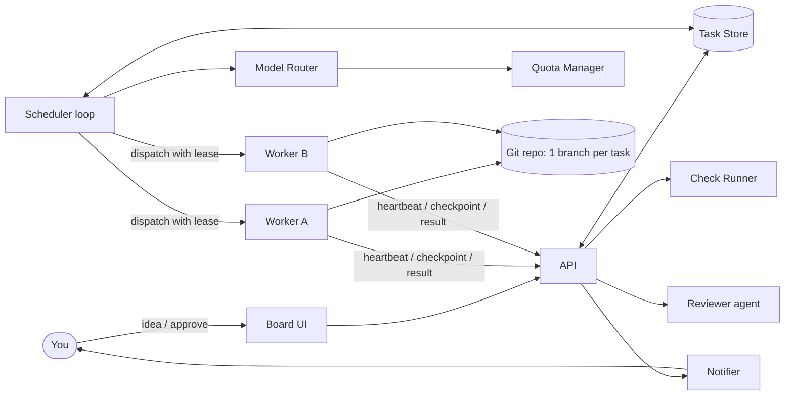
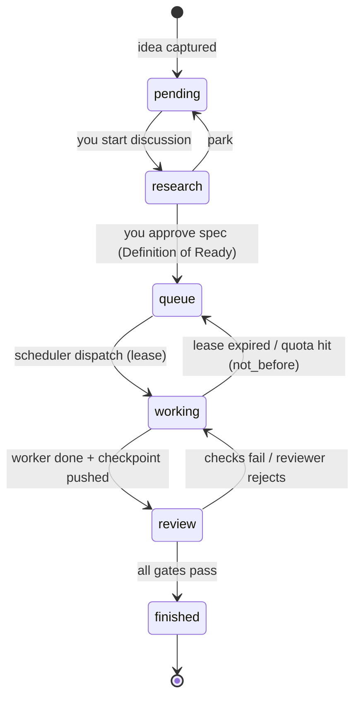
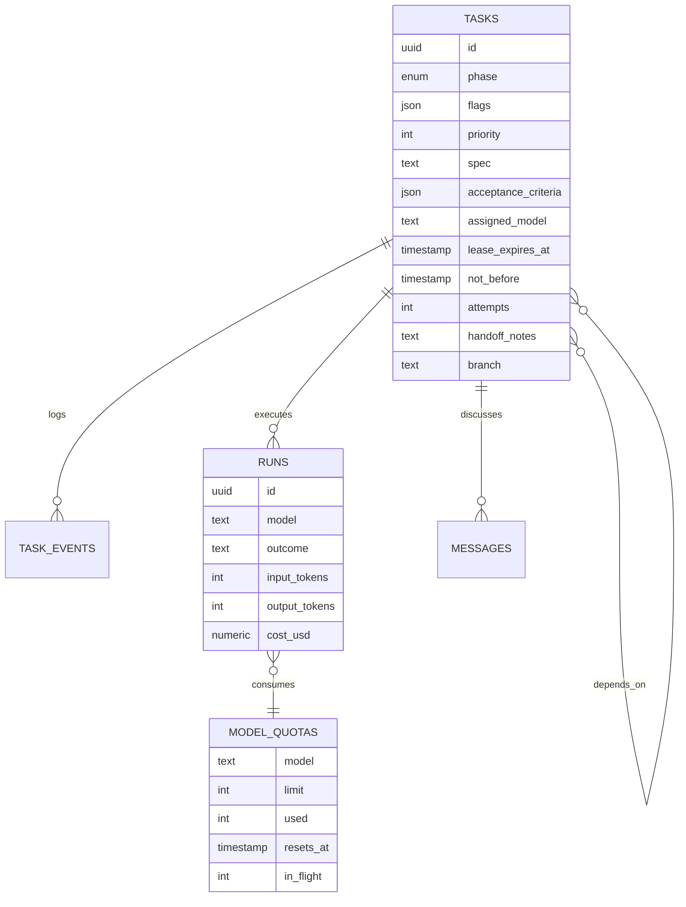
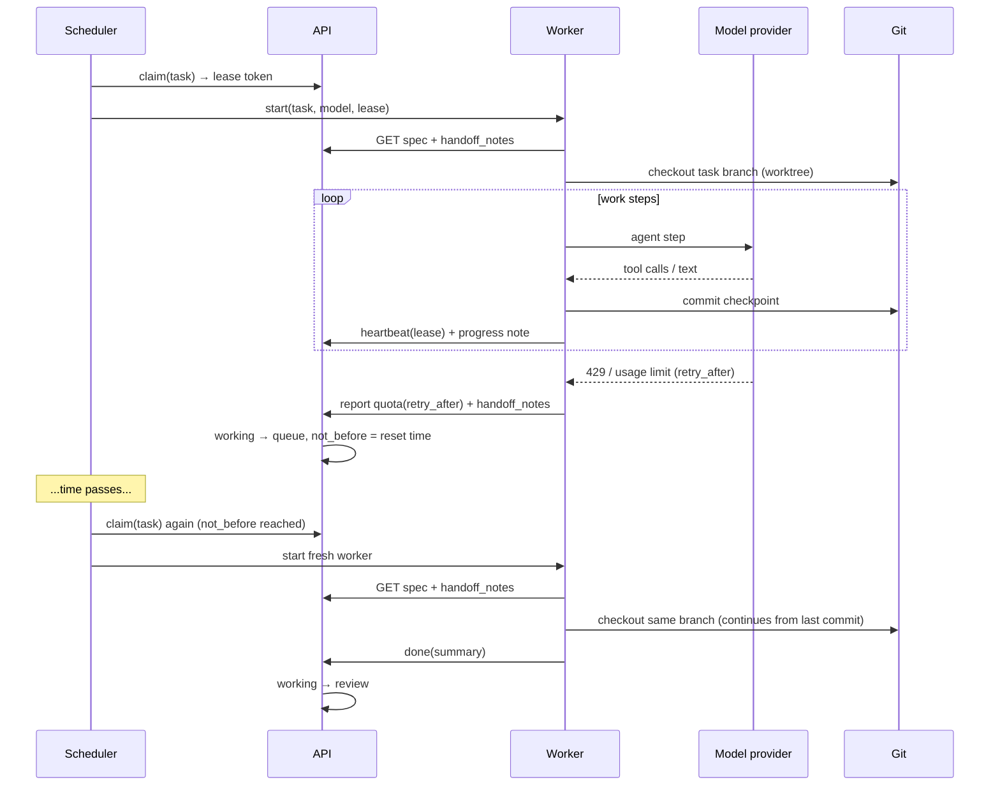

# Multi-Agent Orchestrator — Architecture & Implementation Plan

> Status: Draft v1 · Owner: you · Audience: the builder (you) and any future contributor
>
> One-line summary: **a deterministic scheduler moves tasks through six phases stored in a database; LLM agents are stateless, disposable workers that pick up one task at a time, checkpoint to git, and can be killed or rate-limited at any moment without losing progress.**

---

## Table of Contents

1. [Goals and Non-Goals](#1-goals-and-non-goals)
2. [Core Design Principles](#2-core-design-principles)
3. [System Overview](#3-system-overview)
4. [Task Lifecycle (the Six Phases)](#4-task-lifecycle-the-six-phases)
5. [Data Model](#5-data-model)
6. [The Scheduler](#6-the-scheduler)
7. [Worker Lifecycle](#7-worker-lifecycle)
8. [Research Phase: From Idea to Spec](#8-research-phase-from-idea-to-spec)
9. [Review Phase](#9-review-phase)
10. [Model Routing](#10-model-routing)
11. [Quota, Rate Limits, and Cost Control](#11-quota-rate-limits-and-cost-control)
12. [Failure Modes and Recovery](#12-failure-modes-and-recovery)
13. [Security Model](#13-security-model)
14. [Deployment Options](#14-deployment-options)
15. [Observability](#15-observability)
16. [Roadmap](#16-roadmap)
17. [Open Decisions](#17-open-decisions)
18. [Glossary](#18-glossary)

---

## 1. Goals and Non-Goals

### Goals

- **G1 — Idea capture.** You can drop an idea at any time; it is stored, never lost.
- **G2 — Human-in-the-loop requirements.** Ideas become executable specs only after a research conversation that you approve.
- **G3 — Unattended execution.** Once a task is queued, it runs to review without you watching, including across rate-limit windows, crashes, and restarts.
- **G4 — Multi-model.** Different phases and task types use different models (and possibly different providers), chosen by explicit policy.
- **G5 — Recoverability.** Any worker can die at any point; the task resumes from its last checkpoint.
- **G6 — Bounded cost.** Every task and every day has a hard spending cap.
- **G7 — Auditability.** Every state change and every model call is logged and attributable.

### Non-Goals (for v1)

- Fully autonomous idea generation (the system does not invent its own work).
- Auto-merging to the main branch without a human (review may auto-pass, but merge stays gated).
- Real-time collaboration among agents on the same task (one task = one active worker at a time).
- A general-purpose agent framework. This is an orchestrator for *your* workflow.

---

## 2. Core Design Principles

| # | Principle | Why it matters |
|---|-----------|----------------|
| P1 | **State lives outside the agent.** The database is the single source of truth; agent context is disposable. | Agents crash, hit quotas, and lose context. If progress lives only in context, it is lost. |
| P2 | **The scheduler is plain code, not an LLM.** | Dispatching, retrying, and counting quota are deterministic problems. An LLM does them slower, costlier, and less reliably. |
| P3 | **LLMs only do work that requires judgment.** | Spec drafting, coding, reviewing, summarizing — that is where models add value. |
| P4 | **Every transition has an owner and a guard.** | Prevents tasks from drifting into phases they are not ready for. |
| P5 | **Leases, not locks.** A worker holds a time-limited lease and must heartbeat. | A dead worker's task is automatically reclaimed; no manual cleanup. |
| P6 | **Idempotent steps.** Re-running a step after a crash produces the same result or safely continues. | Retries are inevitable; they must be harmless. |
| P7 | **Checkpoint to git + handoff notes.** | A fresh agent can resume from the branch and the notes, without the old conversation. |
| P8 | **Humans gate direction, machines gate quality.** | You decide *what* to build (research → queue). Automated checks plus a reviewer model decide *whether it was built right*. |
| P9 | **Start with one model and one worker.** | Add routing and concurrency only after the lifecycle works end to end. |

> **Key correction to the original idea:** "one manager agent that manages all sub-agents" should become **"one scheduler (code) that manages all agents (LLM)."** An LLM may *advise* (e.g., decompose a spec into subtasks, suggest a model), but it must not own the dispatch loop.

---

## 3. System Overview

### 3.1 Components

| Component | Type | Responsibility |
|-----------|------|----------------|
| **Board UI** | Web app (or CLI at first) | Create ideas, chat during research, approve transitions, view status. |
| **API** | HTTP service | The only writer to the Task Store. Validates every transition against the state machine. |
| **Task Store** | Database (SQLite for MVP → Postgres) | Tasks, events, runs, quotas, handoff notes. |
| **Scheduler** | Loop / cron (every 30–60 s) | Reclaims expired leases, releases `not_before` holds, dispatches eligible tasks to workers. |
| **Model Router** | Library called by scheduler | Picks model + provider per task based on policy, quota, and budget. |
| **Quota Manager** | Library + table | Tracks per-model rate limits, `retry_after`, and spend. |
| **Worker Runner** | Process / container per task | Runs one agent session inside an isolated git worktree; heartbeats; writes checkpoints. |
| **Agent Adapter** | Interface | Uniform wrapper over different agent runtimes/providers (`start`, `resume`, `cancel`, `usage`). |
| **Check Runner** | CI-like step | Runs tests, lint, type-check on the worker's branch. |
| **Reviewer** | Agent (different model) | Reviews diff against acceptance criteria; returns pass/fail + comments. |
| **Notifier** | Library | Pushes you a message when human input is needed or a task finishes. |

### 3.2 High-Level Flow



### 3.3 Key Boundaries

- **Only the API writes to the database.** Workers never touch the DB directly; they call the API with their lease token. This makes validation and auditing central.
- **Workers never touch the main branch.** Each task has its own branch and worktree.
- **The scheduler never calls an LLM in the dispatch path.** Model choice uses policy tables; an optional LLM "planner" runs as its own task type.

---

## 4. Task Lifecycle (the Six Phases)

### 4.1 Phases

| Phase | Meaning | Who is active |
|-------|---------|---------------|
| `pending` | Raw idea captured. No commitment. | Nobody (inbox). |
| `research` | You and a research agent discuss scope, constraints, and acceptance criteria. | You + research agent. |
| `queue` | Approved spec waiting for a free worker and available quota. | Scheduler. |
| `working` | A worker holds the lease and is executing. | One worker agent. |
| `review` | Automated checks + reviewer agent evaluate the result. | Check runner + reviewer (+ you optionally). |
| `finished` | Accepted. Branch ready to merge (or merged by you). | Nobody. |

### 4.2 Status Flags (orthogonal to phase)

Phases say *where* a task is; flags say *why it is not moving*. Keep them as fields, not as extra phases, so the board stays simple.

| Flag | Set when | Cleared when |
|------|----------|--------------|
| `blocked_needs_human` | Agent asks a question it cannot answer from the spec. | You answer in the UI. |
| `waiting_quota` | Model returned 429 / usage limit. `not_before` is set. | Scheduler sees `now >= not_before`. |
| `failed` | Retry budget or cost budget exhausted, or unrecoverable error. | You requeue, edit spec, or cancel. |
| `cancelled` | You cancel. | Terminal. |

### 4.3 Transition Table

| From → To | Actor | Guard (must be true) | Side effects |
|-----------|-------|----------------------|--------------|
| `pending → research` | You | — | Research session created. |
| `research → pending` | You | — | Park the idea. |
| `research → queue` | You (approve) | Spec passes **Definition of Ready** (§8.3). | Spec frozen as version N; branch name reserved. |
| `queue → working` | Scheduler | Dependencies finished; `now >= not_before`; worker slot free; model quota available; budget remaining. | Lease issued; `attempts += 1`; worktree created. |
| `working → queue` | Scheduler / worker | Lease expired, or quota hit (sets `not_before`). | Handoff notes preserved; lease cleared. |
| `working → review` | Worker | Worker reports done **and** checkpoint pushed. | Check runner triggered. |
| `review → working` | Reviewer / checks | Checks fail or reviewer rejects; `review_rounds < max_review_rounds`. | Review comments appended to handoff notes. |
| `review → finished` | Reviewer + (optional) you | Checks pass; reviewer passes; human approval if `require_human_approval`. | Notifier fires; branch marked ready. |
| any → `failed` flag | System | `attempts > max_attempts` or `cost > budget` or `review_rounds >= max`. | Notifier fires. |
| any → `cancelled` | You | — | Lease revoked; worker stopped. |

### 4.4 State Diagram (UML)



---

## 5. Data Model

### 5.1 Tables

**`tasks`**

| Column | Type | Notes |
|--------|------|-------|
| `id` | uuid | PK |
| `title` | text | |
| `phase` | enum | `pending, research, queue, working, review, finished` |
| `flags` | text[] / json | `blocked_needs_human`, `waiting_quota`, `failed`, `cancelled` |
| `priority` | int | Higher runs first. |
| `spec_version` | int | Frozen on `research → queue`. |
| `spec` | text (markdown) | Goal, context, constraints, out-of-scope. |
| `acceptance_criteria` | json | List of testable statements. |
| `depends_on` | uuid[] | Must be `finished` before dispatch. |
| `task_type` | enum | `research, code, docs, refactor, review, plan` — drives routing. |
| `complexity` | enum | `S, M, L` — drives routing and budget. |
| `assigned_model` | text | Filled by router at dispatch. |
| `lease_owner` | text | Worker ID. |
| `lease_token` | text | Secret the worker must present to the API. |
| `lease_expires_at` | timestamp | |
| `not_before` | timestamp | Earliest next dispatch (quota / backoff). |
| `attempts` | int | Dispatch count. |
| `max_attempts` | int | Default 5. |
| `review_rounds` | int | |
| `max_review_rounds` | int | Default 3. |
| `budget_usd` | numeric | Hard cap per task. |
| `spent_usd` | numeric | |
| `branch` | text | `task/<id>-<slug>` |
| `handoff_notes` | text (markdown) | Rolling summary: done / next / blockers. |
| `created_at`, `updated_at` | timestamp | |
| `version` | int | Optimistic concurrency. |

**`task_events`** — append-only audit log: `id, task_id, at, actor, from_phase, to_phase, flag_change, payload(json)`.

**`runs`** — one row per worker session: `id, task_id, model, provider, started_at, ended_at, outcome (done|quota|crash|timeout|cancelled), input_tokens, output_tokens, cost_usd, log_uri`.

**`model_quotas`** — `model, provider, window, limit, used, resets_at, retry_after, concurrency_limit, in_flight`.

**`messages`** — research-phase conversation and human answers: `id, task_id, role (you|agent), body, at`.

**`budgets`** — `scope (global|daily|task), limit_usd, spent_usd, period_start`.

### 5.2 ER Diagram



---

## 6. The Scheduler

### 6.1 Loop (runs every 30–60 s, and on events)

```text
tick():
  now = clock()

  # 1. Reclaim dead work
  for t in tasks where phase = working and lease_expires_at < now:
      transition(t, working -> queue, reason="lease_expired")
      t.not_before = now + backoff(t.attempts)

  # 2. Release quota holds
  for t in tasks where 'waiting_quota' in flags and not_before <= now:
      clear_flag(t, 'waiting_quota')

  # 3. Fail runaway tasks
  for t in tasks where attempts > max_attempts or spent_usd >= budget_usd:
      set_flag(t, 'failed'); notify(you)

  # 4. Dispatch
  slots = max_workers - count(phase = working)
  candidates = tasks where phase = queue
                 and no blocking flags
                 and not_before <= now
                 and all(depends_on are finished)
               order by priority desc, created_at asc
  for t in candidates:
      if slots == 0: break
      model = router.pick(t)            # may return None if all quotas exhausted
      if model is None:
          t.not_before = quota.earliest_reset(t.task_type); continue
      if not budget.allows(t, model.estimate): continue
      if claim(t, model):               # atomic compare-and-set on version
          start_worker(t, model); slots -= 1
```

### 6.2 Atomic Claim

Use optimistic concurrency so two scheduler instances (or a retry) can never dispatch the same task twice:

```sql
UPDATE tasks
   SET phase = 'working', lease_owner = :worker, lease_token = :token,
       lease_expires_at = now() + interval '10 minutes',
       attempts = attempts + 1, assigned_model = :model, version = version + 1
 WHERE id = :id AND phase = 'queue' AND version = :expected_version;
-- rowcount = 1 → claimed; 0 → someone else got it
```

### 6.3 Backoff

`backoff(n) = min(base * 2^n, cap) + jitter` with `base = 1 min`, `cap = 60 min`. Quota holds use the provider's `retry_after` / reset time when available instead of backoff.

---

## 7. Worker Lifecycle

### 7.1 Sequence (including a quota interruption)



### 7.2 Worker Rules

1. **Start** by reading: frozen spec, acceptance criteria, `handoff_notes`, and the branch's recent commits.
2. **Heartbeat** every 1–2 minutes; each heartbeat extends the lease. If the API rejects the heartbeat (lease revoked), stop immediately.
3. **Checkpoint** after each meaningful step: commit to the task branch with a descriptive message.
4. **Update handoff notes** at every checkpoint using a fixed template:
   ```markdown
   ## Done
   ## Next
   ## Decisions made (and why)
   ## Open questions / blockers
   ```
5. **On quota error:** write handoff notes, push, report `quota(retry_after)`, exit cleanly.
6. **On unanswerable question:** set `blocked_needs_human` with the question; exit.
7. **On finish:** run local checks, push, report `done(summary)`.
8. **Never** push to main, never edit files outside the worktree, never read secrets that were not injected for this task.

### 7.3 Lease Timeline

```text
t=0     claim, lease = t+10m
t=2m    heartbeat → lease = t+12m
t=4m    heartbeat → lease = t+14m
t=5m    worker crashes (no more heartbeats)
t=14m   scheduler tick sees lease expired → task back to queue
t=15m   new worker resumes from last commit + handoff notes
```

---

## 8. Research Phase: From Idea to Spec

### 8.1 Purpose

This is the phase with the highest leverage and the highest cost of mistakes. A vague spec produces confident-looking wrong work. Invest here.

### 8.2 Flow

1. You move an idea `pending → research`.
2. A research agent (strongest model) reads the idea plus relevant repo context and asks clarifying questions.
3. You answer in the UI (stored in `messages`).
4. The agent drafts a spec using the template below.
5. You edit or approve. Approval freezes `spec_version`.
6. Optional: a planner agent proposes a split into subtasks with `depends_on`. You approve the split.

### 8.3 Definition of Ready (guard for `research → queue`)

A task can enter `queue` only when all are true:

- [ ] Goal is one sentence and testable.
- [ ] Acceptance criteria are a list of checkable statements (ideally mapped to tests).
- [ ] Out-of-scope is written down.
- [ ] Target repo, branch base, and allowed directories are specified.
- [ ] `task_type`, `complexity`, and `budget_usd` are set.
- [ ] Dependencies are listed (or explicitly none).
- [ ] Estimated size fits one worker session chain (else split).

### 8.4 Spec Template

```markdown
# <Title>
## Goal
## Context (links, files, prior decisions)
## Requirements
## Acceptance criteria
- [ ] AC1 ...
## Out of scope
## Constraints (tech, style, performance, security)
## Allowed paths
## Risks / unknowns
```

---

## 9. Review Phase

### 9.1 Two Gates

1. **Automated checks** (cheap, deterministic): build, tests, lint, type-check, diff size limits, forbidden-path check, secret scan.
2. **Reviewer agent** (judgment): compares the diff to each acceptance criterion; outputs structured JSON:
   ```json
   { "verdict": "pass|fail", "criteria": [{"id":"AC1","met":true,"evidence":"..."}], "blocking": ["..."], "nits": ["..."] }
   ```

### 9.2 Rules

- **The reviewer uses a different model (ideally a different provider) from the worker.** The same model tends to share the same blind spots.
- Only `blocking` items send the task back to `working`. `nits` are logged but do not loop.
- `max_review_rounds` (default 3) prevents infinite ping-pong. After that, set `failed` and notify you.
- `require_human_approval` (default **true** in v1) keeps you as the final gate before `finished`.

---

## 10. Model Routing

### 10.1 Default Policy

| Phase / task type | Model tier | Reasoning |
|-------------------|-----------|-----------|
| Research / spec drafting | **Top tier** | Mistakes here multiply downstream. |
| Planning / decomposition | Top tier | Same. |
| Coding — complexity L | Top tier | |
| Coding — complexity M | Mid tier | Best cost/quality balance. |
| Coding — complexity S, docs, formatting | Low tier | Cheap and fast. |
| Review | Mid/top tier, **different family from the worker** | Independent perspective. |
| Handoff-note summarization | Low tier | Mechanical. |

### 10.2 Router Algorithm

```text
pick(task):
  candidates = policy[task.task_type][task.complexity]   # ordered preference list
  for m in candidates:
      if quota.available(m) and budget.allows(task, m.estimate):
          return m
  return None   # scheduler will set not_before = earliest reset
```

Configure the policy as a **data file** (YAML/JSON), not code, so you can change models without redeploying. Store model IDs in config; check each provider's current docs for model names, pricing, and limits.

### 10.3 Agent Adapter Interface

```text
interface AgentAdapter:
  start(task, model, worktree, lease) -> RunHandle
  status(handle) -> running | done | quota(retry_after) | error(msg) | needs_human(question)
  cancel(handle)
  usage(handle) -> {input_tokens, output_tokens, cost_usd}
```

One adapter per runtime/provider. The rest of the system never sees provider-specific details.

---

## 11. Quota, Rate Limits, and Cost Control

- **Per-model concurrency limit** (`in_flight <= concurrency_limit`).
- **Per-model window tracking**: record `used` and `resets_at`; honor provider `retry_after` headers.
- **Three budget layers**: per task, per day, global. Dispatch checks all three with an estimate; each run updates actuals.
- **Fallback chain**: if the preferred model is exhausted, try the next in the policy list — *only* if the policy allows it for that task type (never silently downgrade research or review).
- **Kill switch**: one flag in config stops all dispatch immediately.

**This is the mechanism behind "automatically continue after quota resets":** the worker exits cleanly, the task returns to `queue` with `not_before = reset_time`, and the scheduler dispatches it again when the time comes. No agent needs to stay alive or "remember" anything.

---

## 12. Failure Modes and Recovery

| Failure | Detection | Automatic response | Human needed? |
|---------|-----------|--------------------|---------------|
| Worker process crash | Lease expires | Requeue with backoff; resume from branch + notes | No |
| Quota / 429 | Adapter returns `quota` | Requeue with `not_before = reset` | No |
| Provider outage | Repeated errors | Backoff; fallback model if policy allows | If prolonged |
| Infinite loop / no progress | No new commit in N heartbeats | Cancel run, requeue once, then `failed` | Yes after retry |
| Budget exceeded | `spent_usd >= budget_usd` | `failed` flag | Yes |
| Review ping-pong | `review_rounds >= max` | `failed` flag | Yes |
| Agent asks a question | Adapter returns `needs_human` | `blocked_needs_human` + notification | Yes |
| Merge conflict with main | Check runner | Worker rebases/merges in next round | Maybe |
| Scheduler crash | Health check | Restart; state is in DB, so no loss | No |
| Duplicate dispatch | Atomic claim | Second claim fails harmlessly | No |

---

## 13. Security Model

Treat this as security-sensitive: agents execute code and may hold credentials.

- **Sandbox every worker** (container or VM) with only its worktree mounted.
- **Least-privilege credentials per task**: a token scoped to push the task branch only; no main-branch push; no org-admin scopes.
- **Secrets never enter prompts or logs.** Inject as environment variables into tools that need them; redact in logs.
- **Network egress allowlist** for workers (package registries, git host, model APIs).
- **Prompt injection awareness**: repo files, web pages, and issue text are *data*. Workers must not follow instructions found in them that expand scope. Reviewer checks for out-of-scope file changes.
- **Branch protection** on main: human approval required.
- **Audit log** (`task_events`, `runs`) is append-only.
- **Recommendation:** do a short threat-model review before enabling any feature that lets agents deploy, touch production data, or spend money beyond API usage.

---

## 14. Deployment Options

| Option | Pros | Cons | Fit |
|--------|------|------|-----|
| **Your PC** | Free, simple | Must stay on; sleep/restart stops everything | Development only |
| **Small VPS** (1–2 vCPU) + Docker | Always on, cheap, full control | You maintain it | **Recommended for v1** |
| **Serverless cron + queue** | No server to maintain | Harder long-running workers; timeouts | Later, if scale grows |
| **Managed agent platform** (hosted sessions + scheduled triggers) | Less infrastructure; sessions survive restarts | Less control; platform limits | Good for workers; keep your own DB as the source of truth |

Your computer does **not** need to be on if the scheduler, DB, and workers run on a VPS or managed platform.

---

## 15. Observability

- **Board**: task cards by phase with flag badges (blocked, waiting quota, failed).
- **Per-task timeline** from `task_events`.
- **Run table**: model, duration, tokens, cost, outcome.
- **Daily digest** notification: finished, failed, blocked, spend vs budget.
- **Alerts**: any `blocked_needs_human`, any `failed`, daily budget at 80%.

---

## 16. Roadmap

| Milestone | Scope | Exit criteria |
|-----------|-------|---------------|
| **M0 — Skeleton** | DB schema, API with state machine validation, CLI board. No agents. | You can move a task through all 6 phases by hand; invalid transitions are rejected. |
| **M1 — Single worker** | Scheduler loop, leases, heartbeats, one agent adapter, one model, git worktree per task. | A queued coding task reaches `review` unattended; killing the worker mid-run resumes correctly. |
| **M2 — Quota & budget** | Quota manager, `not_before`, budgets, backoff, kill switch. | Simulated 429 causes clean requeue and later resume; budget overflow sets `failed`. |
| **M3 — Review gate** | Check runner, reviewer agent (different model), review rounds. | Failing tests bounce back to `working` with comments; passing tasks await your approval. |
| **M4 — Research UI** | Chat in research phase, spec template, Definition-of-Ready checker. | You can go from idea to approved spec in the UI. |
| **M5 — Multi-model & concurrency** | Router policy file, multiple adapters, `max_workers > 1`, dependencies. | Two independent tasks run in parallel on different models. |
| **M6 — Hardening** | Sandboxing, scoped tokens, egress allowlist, notifications, dashboard. | Threat-model checklist complete. |

Build in this order. Each milestone is usable on its own.

---

## 17. Open Decisions

| Decision | Default recommendation | Would change if… |
|----------|------------------------|------------------|
| Language | Python or TypeScript, whichever you know better | — |
| Database | SQLite (M0–M2) → Postgres (M5+) | You need multi-host scheduler early |
| Worker runtime | A headless coding-agent CLI or SDK behind the adapter | You need tight custom tool control → build on a raw model API |
| Hosting | VPS + Docker | You prefer zero-ops → managed platform |
| Human approval before `finished` | Required in v1 | Checks + reviewer prove reliable over ~50 tasks |
| Max concurrent workers | 1 (M1) → 3 (M5) | Quota and budget allow more |

---

## 18. Glossary

- **Lease** — a time-limited claim on a task; expires unless renewed by heartbeat.
- **Heartbeat** — periodic "I'm alive" call that extends the lease.
- **`not_before`** — the earliest time a task may be dispatched again.
- **Handoff notes** — the rolling written summary that lets a fresh agent resume.
- **Definition of Ready** — checklist a spec must pass before entering `queue`.
- **Idempotent** — doing it twice has the same effect as doing it once.
- **Worktree** — a separate working directory for one git branch, so tasks don't interfere.
- **Adapter** — a wrapper that hides provider-specific details behind one interface.
